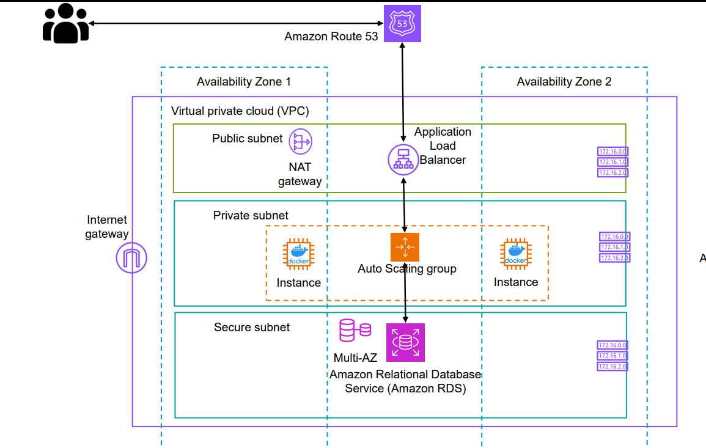

# Cloud Architecture Design and Deployment with Terraform  

## Project Overview  
Designed and deployed a secure and scalable cloud architecture using **Terraform**, featuring three subnet types: Public, Private, and Secure. This architecture includes a highly available Load Balancer, an Auto Scaling Group (ASG) for the application tier, and a secure RDS instance for the database tier. Additionally, **VPC Flow Logs** were enabled for monitoring and troubleshooting. The deployment includes the **PetClinic Java-based application** as the workload.  

---

## Key Features  

### Subnet Design  
- **Public Subnets**:  
  - Routes traffic through an **Internet Gateway** for inbound and outbound internet access.  
- **Private Subnets**:  
  - Utilizes a **NAT Gateway** for secure outbound internet access while blocking inbound internet traffic.  
- **Secure Subnets**:  
  - Completely isolated from both **Internet Gateway** and **NAT Gateway**, ensuring maximum security.  

### Load Balancer  
- Deployed in **Public subnets** across two Availability Zones (AZs) for high availability.  
- Configured with listeners and target groups to route traffic to the application tier.  

### Auto Scaling Group (ASG)  
- Deployed in **Private subnets** across two AZs.  
- Ensures no public IPs are assigned to instances, with access enabled via **SSM** for management.  
- Configured with desired, minimum, and maximum instance counts set to `1`.  

### RDS Database  
- Deployed in the **Secure subnet** to reduce costs and enhance security.  
- Configured for restricted access, allowing only the application tier to communicate with the database.  

### Monitoring and Troubleshooting  
- Enabled **VPC Flow Logs** to capture and analyze application traffic for monitoring and troubleshooting.  

### Application Deployment  
- Deployed the **PetClinic Java-based application** in the ASG, connected to the RDS database.  

---

## Tools and Technologies Used  

- **Infrastructure as Code (IaC)**: Terraform  
- **Cloud Provider**: Amazon Web Services (AWS)  
  - Services: VPC, EC2, RDS, Internet Gateway, NAT Gateway, Load Balancer, VPC Flow Logs  
- **Application**: PetClinic (Java-based)  
- **Access Management**: AWS Systems Manager (SSM)  

## Architecture diagram 




### view below repo's 
   ```
    https://github.com/spring-projects/spring-petclinic.git


   ```
---


